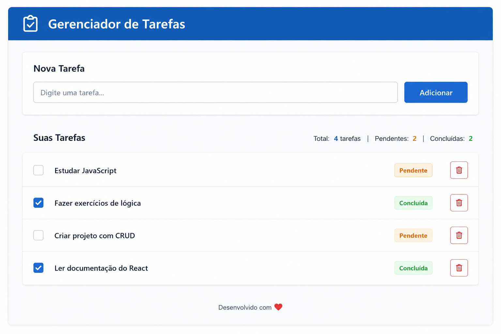

# **📘 PROJETO 4 — Sistema de Gerenciamento de Tarefas com CI/CD Completo**

# **📜 Projeto**

Uma startup está desenvolvendo um sistema simples de gerenciamento de tarefas.

O sistema permitirá:

- cadastrar tarefas
- listar tarefas
- concluir tarefas

A equipe decidiu adotar um fluxo profissional utilizando:

- Git Flow
- Pull Requests
- Jest
- GitHub Actions
- GitHub Pages

Você foi contratado para desenvolver a primeira versão desse sistema.

**Esse projeto deve ser feito em um repositório novo**, ou seja, não é para ser feito no repositório “Forkado”!

O nome do repositório deverá ser: **`projeto4-sistema-de-gerenciamento-de-tarefas`**.

# **📋 Requisitos Funcionais**

## **RF01 — Adicionar tarefa**

O usuário deve poder digitar uma tarefa e clicar em botão `Adicionar`.

A tarefa deve ser adicionada à lista.

## **RF02 — Não permitir tarefas vazias**

Se o usuário clicar em adicionar sem digitar nada, a tarefa não deve ser adicionada.

## **RF03 — Listar tarefas**

Todas as tarefas devem aparecer em uma lista.

## **RF04 — Concluir tarefa**

Cada tarefa deve possuir um botão `Concluir`.

Ao clicar, a tarefa deve ser marcada como concluída.

## **RF05 — Mostrar quantidade de tarefas**

Exemplo: Tarefas: 3

# **🧩 Situação Inicial**

A branch main já possui o sistema em produção.

**📄 index.html**

```html
<!DOCTYPE html>
<html>
<head>
  <title>Meu Site</title>
</head>
<body>
  <h1>Meu Site</h1>
</body>
</html>
```

# **📋 Requisitos Técnicos**

## **RT01 — Git Flow**

Criar:

```
main
develop
feature/tarefas
```

## **RT02 — Pull Request**

Fluxo obrigatório:

```
feature/tarefas
↓
develop
↓
main
```

## **RT03 — Testes Automatizados**

Criar funções:

`adicionarTarefa()`

`concluirTarefa()`

Essas funções devem possuir testes.

# **📋 Testes obrigatórios**

## **Teste 1**

**Adicionar tarefa válida**. Resultado esperado:

`Tarefa adicionada`

## **Teste 2**

**Adicionar tarefa vazia**. Resultado esperado:

`Não adicionar`

## **Teste 3**

**Concluir tarefa.** Resultado esperado:

`Status concluído`

# **📋 Pipeline**

Criar: .github/workflows/ci.yml

Executando: `npm install` e `npm test`

# **📋 Deploy**

Publicar utilizando: GitHub Pages

# 🎨 Design do Sistema

O design abaixo deve ser utilizado como base para o desenvolvimento do sistema:



🤙 Boas práticas!

---

01000101 00100000 01100001 01110001 01110101 01101001 00100000 01100011 01101000 01100101 01100111 01100001 01101101 01101111 01110011 00100000 01100001 01101111 00100000 01101110 01101111 01110011 01110011 01101111 00100000 11111010 01101100 01110100 01101001 01101101 01101111 00100000 01110000 01110010 01101111 01101010 01100101 01110100 01101111 00100000 01100100 01100101 00100000 01010001 01010100 00101110 00100000 01001111 01100010 01110010 01101001 01100111 01100001 01100100 01101111 00100000 01100001 00100000 01110100 01101111 01100100 01101111 01110011 00100000 01110001 01110101 01100101 00100000 01100011 01101000 01100101 01100111 01100001 01110010 01100001 01101101 00100000 01100001 01110100 11101001 00100000 01100001 01110001 01110101 01101001 00101110 00100000 01000100 01100101 01110011 01100101 01101010 01101111 00100000 01100001 00100000 01110100 01101111 01100100 01101111 01110011 00100000 01110101 01101101 00100000 01100110 01110101 01110100 01110101 01110010 01101111 00100000 01100010 01110010 01101001 01101100 01101000 01100001 01101110 01110100 01100101 00100000 01100101 00100000 01100100 01100101 00100000 01110110 11100001 01110010 01101001 01100001 01110011 00100000 01100101 01111000 01110000 01100101 01110010 01101001 11101010 01101110 01100011 01101001 01100001 01110011 00101110 00001010 00001010 01010100 01100101 01101110 01101000 01101111 00100000 01101111 01110010 01100111 01110101 01101100 01101000 01101111 00100000 01100100 01100101 00100000 01110110 01101111 01100011 11101010 00100001 00001010 00001010 01000100 01100101 00100000 01110011 01100101 01110101 00100000 01100011 01101111 01101111 01110010 01100100 00101111 01110000 01110010 01101111 01100110 00100000 01100101 00100000 01100001 01101101 01101001 01100111 01101111 00101100 00100000 01000101 01110110 01100101 01110010 01110011 01101111 01101110 00100000 01010011 01101111 01110101 01110011 01100001 00100000 00111100 00101111 00111110 00101110